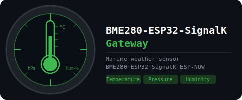

# BME280-ESP32-SignalK Gateway

[](https://www.espressif.com/en/sdks/esp-arduino)
[](https://www.bosch-sensortec.com/products/environmental-sensors/humidity-sensors-bme280/)
[](https://signalk.org)
[](https://github.com/gilmaimon/ArduinoWebsockets)
[](https://www.espressif.com/en/solutions/low-power-solutions/esp-now)
[](LICENSE)

ESP32-based reader for Bosch [BME280](https://www.bosch-sensortec.com/products/environmental-sensors/humidity-sensors-bme280/) environmental sensor. Sends temperature, relative humidity and barometric pressure to [SignalK](https://signalk.org) server via WebSocket/JSON and to other ESP32 devices via ESP-NOW broadcast.

Optionally shows live readings on a 16x2 LCD display. If no WiFi is available the sensor still broadcasts via ESP-NOW.

OTA firmware updates are enabled. Persistent configuration storage (NVS) and web UI are skeleton-implemented and reserved for future use.

Developed and tested on:
- Generic ESP32 development board (ESP-WROOM-32)
- [ESP32 board package](https://github.com/espressif/arduino-esp32) (3.3.7)
- [Arduino IDE](https://www.arduino.cc/en/software/) (2.3.8)
- SignalK Server (2.23.0)
- BME280 sensor

Integrated via ESP-NOW to:
- [Elecrow CrowPanel 2.1inch-HMI ESP32 Rotary Display 480x480 IPS Round Touch Knob Screen](https://www.elecrow.com/wiki/CrowPanel_2.1inch-HMI_ESP32_Rotary_Display_480_IPS_Round_Touch_Knob_Screen.html) separate ESP32 device

## Purpose of the project

This is one of my individual digital boat projects. Use at your own risk. Not for safety-critical navigation.

1. I needed reliable outside weather data (temperature, humidity, pressure) available in SignalK and on the vessel's ESP-NOW data bus
2. I wanted to continue building on the ESP32 gateway design pattern established in previous projects (VEDirect, CMPS14)
3. The BME280 makes for a simple first implementation of the shared `espnow_protocol.h` `WeatherDelta` message type

## Release history

| Release | Branch | Comment |
|---------|--------|---------|
| v1.0.0 | main | Initial release. BME280 reading, SignalK WebSocket, ESP-NOW broadcast, optional LCD. |

## Classes

### Class BME280Processor

The central data class `BME280Processor` reads the BME280 sensor over I2C and exposes the measurements. It has the following public API:

| Method | Returns | Comment |
|--------|---------|---------|
| `begin(TwoWire &wirePort, uint8_t addr)` | `bool` | Initialize sensor at given I2C address |
| `update()` | `bool` | Read sensor and update internal data struct; returns false if any reading is invalid |
| `getDelta()` | `ESPNow::WeatherDelta` | Return current readings as a `WeatherDelta` struct |
| `getTempC()` | `float` | Temperature in °C |
| `getHumidity()` | `float` | Relative humidity in % |
| `getPressureHPa()` | `float` | Barometric pressure in hPa |

The simple usage of BME280Processor could be:

```cpp
#include <Arduino.h>
#include <Wire.h>
#include <Adafruit_BME280.h>
#include "BME280Processor.h"

Adafruit_BME280 bme;
BME280Processor processor(bme);

void setup() {
    Serial.begin(115200);
    Wire.begin(21, 22); // SDA, SCL
    processor.begin(Wire, 0x77);
}

void loop() {
    const unsigned long now = millis();
    static unsigned long last = 0;
    if ((long)(now - last) < 1000) return; // Read at 1 Hz
    last = now;
    if (processor.update()) {
        Serial.println(processor.getTempC());
        Serial.println(processor.getHumidity());
        Serial.println(processor.getPressureHPa());
    }
}
```

### Other classes

<!-- Class diagram here -->

Each class with their full public API. Private attributes only to demonstrate class relationships.

**`BME280Processor`:**
- Owns: `ESPNow::WeatherDelta` (data struct)
- Uses: `Adafruit_BME280`, `TwoWire`
- Owned by: `BME280Application`
- Responsible for: reading the sensor and exposing validated measurements

**`BME280Preferences`:**
- Owns: `Preferences`
- Uses: `BME280Processor`
- Owned by: `BME280Application`
- Responsible for: loading and saving data to ESP32 NVS — *skeleton, not implemented in this version*

**`SignalKBroker`:**
- Owns: `WebsocketsClient`
- Uses: `BME280Processor`
- Owned by: `BME280Application`
- Responsible for: WebSocket connection and delta transmission to SignalK server

**`ESPNowBroker`:**
- Uses: `BME280Processor`
- Owned by: `BME280Application`
- Responsible for: ESP-NOW broadcast of weather data

**`DisplayManager`:**
- Owns: `LiquidCrystal_I2C`
- Uses: `BME280Processor`, `SignalKBroker`
- Owned by: `BME280Application`
- Responsible for: optional LCD 16x2 display

**`WebUIManager`:**
- Owns: `WebServer`
- Uses: `BME280Processor`, `BME280Preferences`, `SignalKBroker`, `DisplayManager`
- Owned by: `BME280Application`
- Responsible for: HTTP web user interface — *skeleton, not implemented in this version*

**`BME280Application`:**
- Owns: `Adafruit_BME280`, `BME280Processor`, `BME280Preferences`, `SignalKBroker`, `ESPNowBroker`, `DisplayManager`, `WebUIManager`
- Uses: `WifiState`
- Responsible for: orchestrating everything within the main program, acts as "the app"

**`WifiState`:**
- Global enum class for WiFi states maintained and shared by `BME280Application`

## Features

### Sensor reading

1. Reads temperature (°C), relative humidity (%) and barometric pressure (hPa) from BME280 over I2C at ~1 Hz
2. Validates each reading with `validf()` — `NaN` and infinite values are discarded
3. Readings are stored as an `ESPNow::WeatherDelta` struct and shared with all subsystems

### SignalK communication

Connects to:
```
ws://<server>:<port>/signalk/v1/stream?token=<optional>
```

**Sends** at ~0.5 Hz frequency with optional deadband filtering (deadband set to 0.0 in this release, meaning every new reading is forwarded):

| SignalK path | Unit | Source value |
|---|---|---|
| `environment.outside.temperature` | Kelvin | °C + 273.15 |
| `environment.outside.relativeHumidity` | ratio 0–1 | % / 100 |
| `environment.outside.pressure` | Pascal | hPa x 100 |

Source name is auto-derived from the device MAC address: `esp32.bme280-XXYYZZ`.

WebSocket reconnects automatically with exponential back-off starting at ~2 s, doubling on each failed attempt up to a ceiling of ~120 s, and resetting to the initial interval when the connection is restored.

### ESP-NOW communication

Broadcasts weather data via ESP-NOW for other ESP32 devices, such as external displays (e.g., CrowPanel 2.1" HMI).

**Sends** at ~0.5 Hz frequency with optional deadband filtering (deadband set to 0.0 in this release):
- `WeatherDelta` struct containing:
  - `temperature_c` — temperature in °C
  - `humidity_p` — relative humidity in %
  - `pressure_hpa` — barometric pressure in hPa

**Broadcast mode:** Uses broadcast address (FF:FF:FF:FF:FF:FF) — any ESP-NOW receiver on the same WiFi channel can listen.

**WiFi coexistence:** ESP-NOW operates alongside WiFi (AP_STA mode). Both SignalK WebSocket and ESP-NOW broadcast function simultaneously.

**Receives:** incoming command processing stub is present; no commands are handled in this version.

**Note: ESP-NOW receivers must be on the same WiFi channel as this device. The simplest approach is to connect both devices to the same WiFi network with a fixed channel.**

### LCD 16x2 display

1. Shows live temperature, humidity and pressure on two rows:
   - Row 0: `T:23.5C  H:65.2%`
   - Row 1: `P:1013.2 hPa`
2. LCD is auto-detected at startup via I2C probe — device boots normally if no display is present
3. Startup splash: `BME280 Gateway` / `Connecting...`

Using a different display can be done within the `DisplayManager` class while ensuring its public API stays intact.

### WiFi and OTA

- WiFi state machine: `INIT → CONNECTING → CONNECTED`, with a 90-second connection timeout and automatic fallback to `OFF` on failure or missing SSID
- Auto-reconnect on dropped connection
- ArduinoOTA enabled immediately after WiFi connects; hostname is set to the SignalK source name

## Project structure

| File(s) | Description |
|---------|-------------|
| `BME280-ESP32-SignalK-gateway.ino` | Owns `BME280Application app`, contains `setup()` and `loop()` |
| `secrets.example.h` | Example credentials. Rename to `secrets.h` and populate with your credentials. |
| `version.h` | Software version |
| `WifiState.h` | Enum class for WiFi states |
| `espnow_protocol.h` | Shared ESP-NOW wire protocol — header, packet template, all payload structs |
| `helpers.h` | `validf()` float validator, test data helpers |
| `BME280Processor.h / .cpp` | Class `BME280Processor`, the "processor" |
| `BME280Preferences.h / .cpp` | Class `BME280Preferences`, the "prefs" — skeleton |
| `SignalKBroker.h / .cpp` | Class `SignalKBroker`, the "signalk" |
| `ESPNowBroker.h / .cpp` | Class `ESPNowBroker`, the "espnow" |
| `DisplayManager.h / .cpp` | Class `DisplayManager`, the "display" |
| `WebUIManager.h / .cpp` | Class `WebUIManager`, the "webui" — skeleton |
| `BME280Application.h / .cpp` | Class `BME280Application`, the "app" |

## Hardware

### Schematic

<!-- Schematic here -->

### Bill of materials

1. ESP32 module (any standard ESP-WROOM-32 development board)
2. BME280 sensor (I2C mode, address 0x77)
3. LCD 16x2 module with I2C backpack (optional, address 0x27)
4. Wiring — I2C bus (SDA GPIO21, SCL GPIO22) shared by BME280 and LCD
5. WiFi router providing wireless LAN AP
6. SignalK server running in LAN

**No paid partnerships.**

## Software used

1. Arduino IDE 2.3.6
2. Espressif Systems esp32 board package 3.3.5
3. Additional libraries installed:
   - Adafruit BME280 Library (by Adafruit, version 2.2.4)
   - Adafruit Unified Sensor (by Adafruit, version 1.1.14)
   - ArduinoWebsockets (by Gil Maimon, version 0.5.4)
   - ArduinoJson (by Benoit Blanchon, version 7.4.2)
   - LiquidCrystal_I2C (by Frank de Brabander, version 1.1.2)

## Installation

1. Clone the repo
   ```
   git clone https://github.com/mkvesala/BME280-ESP32-SignalK-gateway.git
   ```
2. Alternatively, download the code as zip
3. Set up your credentials in `secrets.h` (first by renaming `secrets.example.h` to `secrets.h`)
   ```cpp
   inline constexpr const char* WIFI_SSID = "your_wifi_ssid_here";
   inline constexpr const char* WIFI_PASS = "your_wifi_password_here";
   inline constexpr const char* SK_HOST   = "your_signalk_address_here";
   inline constexpr uint16_t    SK_PORT   = 3000; // replace with your SignalK server port
   inline constexpr const char* SK_TOKEN  = "your_signalk_auth_token_here";
   inline constexpr const char* OTA_PASS  = "your_OTA_password_here";
   ```
4. **Make sure that `secrets.h` is listed in your `.gitignore` file**
5. Connect BME280 to the I2C pins (SDA GPIO21, SCL GPIO22) and optionally connect LCD to the same I2C bus
6. Connect and power up the ESP32 with the USB cable
7. Compile and upload with Arduino IDE (ESP32 board package and required libraries installed)
8. Monitor Serial output (115200 baud) to verify sensor readings and WiFi/SignalK connection status

## Todo

- Implement `WebUIManager` — simple web UI for viewing live readings and adjusting settings
- Implement `BME280Preferences` — NVS persistence for user-adjustable temperature offset
- Add web UI authentication once `WebUIManager` is implemented
- Consider an asynchronous `esp_http_server` to replace the `WebServer` to avoid `loop()` blocking

## Security

### Maritime navigation

**Use at your own risk — not for safety-critical navigation!**

### Important security considerations

1. **HTTP only (No HTTPS)**
   - Use only on private, trusted networks

2. **LAN deployment only**
   - Do NOT expose to public internet
   - Keep ESP32 on isolated WiFi
   - Use WPA2/WPA3 encryption

3. **SignalK token visibility**
   - SignalK authentication token is visible in the WebSocket URL
   - Keep ESP32 and SignalK server on the same private network

4. **`secrets.h`**
   - Make sure that `secrets.h` is listed in your `.gitignore` file

### Deployment

**Recommended:**
- Deploy on private isolated boat WiFi
- Use WPA2/WPA3 WiFi encryption

**Not recommended:**
- Public internet exposure
- Port forwarding to ESP32
- Sharing WiFi network with untrusted devices

## Credits

Developed and tested using:

- Generic ESP32 development board (ESP-WROOM-32)
- Espressif Systems esp32 3.3.5 package on Arduino IDE 2.3.6
- SignalK Server version 2.18.0

Check [CONTRIBUTING.md](CONTRIBUTING.md) for further information on AI-assisted development in the project.

Developed by Matti Vesala in collaboration with Claude (Anthropic). Claude was used as the primary coding partner for architecture design, implementation and code review.

I would highly appreciate improvement suggestions as well as any Arduino-style ESP32/C++ coding advice before entering into SensESP/PlatformIO universe in my next project. 😃

## Gallery

<!-- Photos here -->
